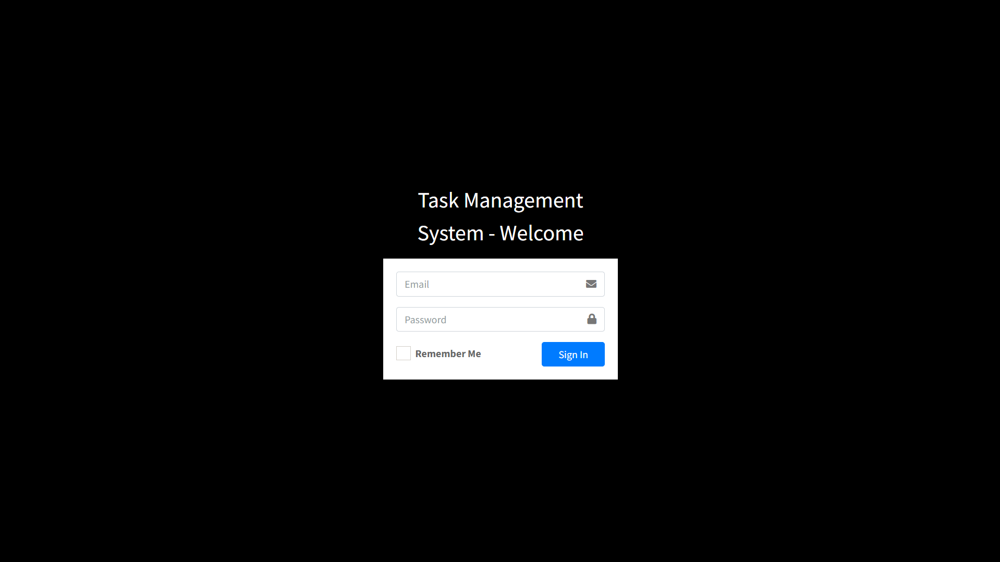
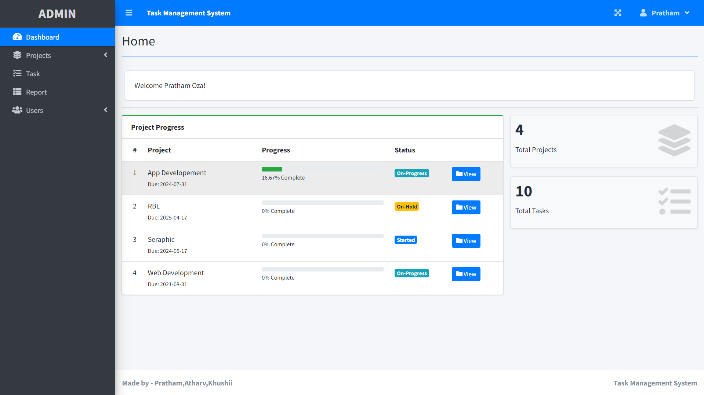
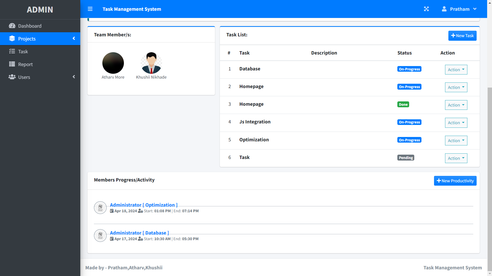

Task Management System (TMS)
TMS is a comprehensive task management system designed to streamline project management and enhance team collaboration. With three authority levels—Admin, Project Manager, and Employee—TMS offers a sophisticated UI, intuitive navigation, and a range of features to optimize productivity.

Key Features:
1.Three Authority Levels: Admin, Project Manager, and Employee, each with specific privileges and access rights.
2.Sophisticated UI: A user-friendly interface with a progress bar dashboard for easy tracking.
3.Project Management: Create new projects, assign managers and employees, and provide detailed descriptions.
4.Task Assignment: Admin and managers can add tasks, categorizing them into three priorities: On Hold, In Progress, and Done.
5.Productivity Tracking: Employees can log their daily productivity, allowing admins and managers to monitor progress effectively.

Why TMS?
->TMS revolutionizes project management by promoting efficiency and cooperation among team members. Its intuitive interface and comprehensive features make it the ideal choice for businesses looking to enhance productivity.

Screenshots

Installation and Setup
To run TMS locally:

1.Download and install XAMPP or WAMP server.
2.Import the provided .sql file into a database named "tms_db".
3.Start the server and navigate to localhost in your browser.
4.Run the application, and you're ready to go!

Feedback and Support
We welcome any feedback or suggestions for improving TMS
